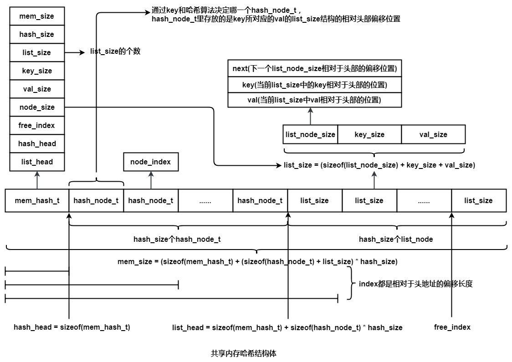

>最近在学习大神同事hxw的代码设计，再此做一个总结。

# 共享内存哈希表结构体设计
共享内存哈希表的设计借助的静态链表的思想，建议先研究了解一下静态链表:
1. [[读书笔记]-大话数据结构-3-线性表(三)-静态链表、循环链表和双向链表](https://www.cnblogs.com/zhaoxy/p/7754906.html)
2. [静态链表的C实现和核心点(基于数据结构 严蔚敏)](https://www.cnblogs.com/zrj-xjyd/p/8735145.html)

静态链表的优缺点：

1. 优点：再插入和删除时候，只需要修改游标，不需要移动元素，从而改进了顺序存储结构中插入和删除操作需要移动大量元素的缺点。
2. 缺点：没有解决连续存储分配带来的表长难以确定的问题；失去了顺序存储结构随机存取的特性。


```c
/* 哈希节点 */
typedef struct hash_node_s hash_node_t;
struct hash_node_s
{
    unsigned int node_index;    /* 链表节点index */
};

/* 链表节点个数 */
typedef struct list_node_s list_node_t;
struct list_node_s
{
    unsigned int next;     /* 下一个节点index */
    unsigned int key;      /* key的index */
    unsigned int val;      /* val的index */
}

/* 静态内存哈希表头结构信息 */
typedef struct mem_hash_s mem_hash_t;
struct mem_hash_s
{
    unsigned int mem_size;      /* 内存总大小 */
    unsigned int hash_size;     /* 哈希节点个数 */
    unsigned int list_size;     /* 链表节点个数 */
    unsigned int key_size;      /* key大小 */
    unsigned int val_size;      /* val大小 */
    /* node_size = sizeof(list_node_t) + key_size + val_size */
    unsigned int node_size;     /* 链表节点大小 */
    unsigned int free_index;    /* 空闲的链表头节点index */

    unsigned int hash_head;     /* 哈希头节点index */
    unsigned int list_head;     /* 链表头节点index */
}

/* 迭代器 */
typedef struct mem_hash_iterator_s mem_hash_iterator_t;
struct mem_hash_iterator_s
{
    unsigned int hash_num;      /* 当前哈希节点 */
    unsigned int node_next;     /* 下一个链表节点 */
}
```

# 哈希函数
哈希函数采用的是Redis里使用的经典Times 33哈希算法。又叫DJBX33A，Bernstein's hash。该算法由Daniel J. Bernstein教授多年前在comp.lang.c发表。它是有史以来发布的最有效的哈希函数之一。
关于该算法的更多了解：
1. [经典的Times 33 哈希算法](https://zhanjia.iteye.com/blog/2426782?utm_medium=referral)
2. [HASH表](https://my.oschina.net/myspaceNUAA/blog/68241)
```c
/* Generic hash function (a popular one from Bernstein).
 * I tested a few and this was the best. */
unsigned int dict_gen_hash_function(const unsigned char *buf, int len)
{
    unsigned int hash = 5381;

    while (len--)
        hash = ((hash << 5) + hash) + (*buf++); /* hash * 33 + c */
    return hash;
}
```
# 使用接口设计
## mem_hash_init 初始化
由共享内存开辟可知，共享内存哈希表为静态的，大小需要由具体问题提前决定。
需要确定的参数有:**mem_size, hash_size, key_size, val_size**。

且**mem_size >= (sizeof(mem_hash_t) + sizeof(hash_node_t) * hash_size +  (sizeof(list_node_t)+ key_size + val_size) * hash_size)**;

初始化分三步：
1. 初始化mem_hash_t结构体
2. 初始化hash_node_t结构体
3. 初始化list_node_t结构体

## mem_hash_add 添加key-value

添加元素时
1. 注意:存储key-value的大小一定要与结构体设计初始化时的大小一样。
2. 添加元素到free指针指向的空间list_node_t中，偏移free指针，返回添加元素的相对于头部的偏移位置。
3. 通过key计算该位置存储的哈希位置
    1. 如果该哈希位置的节点存储为空，则直接存入
    2. 如果该哈希位置的节点存储不为空，则遍历该位置的next位置，直到为空，处链接该位置。
4. 
## mem_hash_add_ifnotexist 不存在则插入
该方法添加元素时
1. 先检查该key的哈希位置是否存储有元素。
2. 如果有，则退出。
3. 如果没有，则插入该节点，并连接hash位置。

## mem_hash_delete 删除

## mem_hash_delete_return 删除且返回val值

## mem_hash_find 查找且返回val值

## mem_hash_find_val_index 查找且返回val位置

## mem_hash_update 更新值

## mem_hash_dump 测试遍历结构存储

## mem_hash_get_iterator 建立迭代器

## mem_hash_release_iterator 释放迭代器

## mem_hash_next 迭代返回元素

# 内部接口设计
## gen_hash

## node_init

## node_release

## hash_add

## hash_delete

## hash_find