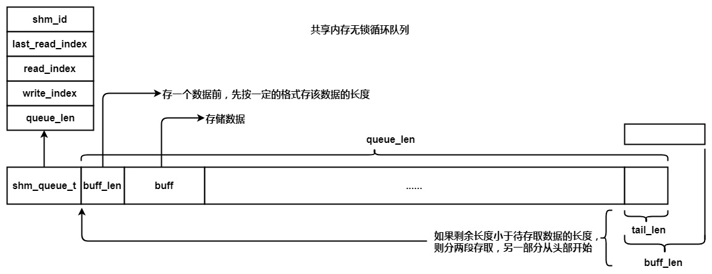

# 共享内存无锁循环队列结构体设计

```c
typedef struct shm_queue_s shm_queue_t;
struct shm_queue_s
{
    //int shm_id;
    int read_index;
    int write_index;
    int queue_len;
};
```
# 队列使用原理
在存取数据时，首先对数据长度进行存取。

将数据长度格式化为固定格式的字符串。

先存取长度，在存取数据。

```c
#define LEN_LEN 6
#define LEN_FORMAT "%06d"
char s_len[LEN_LEN + 1];
snprintf(s_len, sizeof(s_len), LEN_FORMAT, buff_len);
```
## 异常处理
队尾长度不足数据长度时，分段存储读取数据。

# 循环队列特性
## 归一化操作
```c
shm_queue->write_index(新的) = (shm_queue->write_index(上一次) + data_len) % shm_queue->queue_len;

shm_queue->read_index(新的) = (shm_queue->read_index(上一次) + data_len) % shm_queue->queue_len;
```
## 队列空
```c
shm_queue->write_index == shm_queue->read_index
```

## 队列剩余空间
```c
free_len = shm_queue->write_index >= shm_queue->read_index ? (shm_queue->queue_len - shm_queue->write_index + shm_queue->read_index) : (shm_queue->read_index - shm_queue->write_index) ;
```

## 队列满
```c
buff_len(数据长度) + LEN_LEN(元数据长度) >= free_len
```

# 无锁原子操作API
## legacy GCC __sync
type __sync_lock_test_and_set(type*ptr,type value,...)

## C++11
[内存模型](http://blog.jobbole.com/106516/)

bool __atomic_test_and_set(void*ptr,intmemorder);

# 接口设计
## init_shm_queue
```c
int init_shm_queue(shm_queue_t *shm_queue, int shm_id, int queue_len)
{
    if(NULL == shm_queue || 0 >= shm_id || 0 >= queue_len)
    {
        LOG_ERROR("param error");
        return -1;
    }

    shm_queue->shm_id = shm_id;
    shm_queue->last_read_index = 0;
    __sync_lock_test_and_set(&(shm_queue->write_index), 0);
    __sync_lock_test_and_set(&(shm_queue->read_index), 0);
    shm_queue->queue_len = queue_len;
    //memset(shm_queue + sizeof(shm_queue_t), 0x00, shm_queue->queue_len);
    return 0;
}
```
## _enqueue_primitive
```c
static int _enqueue_primitive(shm_queue_t *shm_queue, int *write_index, char *buff, int buff_len)
{
    int write_index_tmp;
    int tail_len = 0;
    char *queue_data = NULL;

    if(NULL == shm_queue || NULL == write_index || NULL == buff || 0 >= buff_len)
    {
        LOG_ERROR("param error");
        return -1;
    }

    /* 注意此处判断条件一定不能为0 */
    if (-1 == *write_index)
    {
        write_index_tmp = shm_queue->write_index;
    }
    else
    {
        write_index_tmp = *write_index; 
    }

    queue_data = (char *)shm_queue + sizeof(shm_queue_t);
    tail_len = shm_queue->queue_len - write_index_tmp;
    if(buff_len <= tail_len)
    {/* 直接存 */
        memcpy(queue_data + write_index_tmp, buff, buff_len);
    }
    else
    {/* 遇到队尾分两段存 */
        memcpy(queue_data + write_index_tmp, buff, tail_len);
        memcpy(queue_data, buff + tail_len, buff_len - tail_len);
        shm_queue->last_read_index = (write_index_tmp + buff_len) % shm_queue->queue_len;
    }

    *write_index = (write_index_tmp + buff_len) % shm_queue->queue_len;

    return 0;
}
```
## _dequeue_primitive
```c
static int _dequeue_primitive(shm_queue_t *shm_queue, int *read_index, char *buff, int buff_len)
{
    int read_index_tmp;
    int tail_len = 0;
    char *queue_data = NULL;

    if(NULL == shm_queue || NULL == read_index || NULL == buff || 0 >= buff_len)
    {
        LOG_ERROR("param error");
        return -1;
    }

    /* 注意此处判断条件一定不能为0 */
    if (-1 == *read_index)
    {
        read_index_tmp = shm_queue->read_index;
    }
    else
    {
        read_index_tmp = *read_index; 
    }

    queue_data = (char *)shm_queue + sizeof(shm_queue_t);
    tail_len = shm_queue->queue_len - read_index_tmp;
    if(buff_len <= tail_len)
    {/* 直接存 */
        memcpy(buff, queue_data + read_index_tmp, buff_len);
    }
    else
    {/* 遇到队尾分两段存 */
        memcpy(buff, queue_data + read_index_tmp, tail_len);
        memcpy(buff + tail_len, queue_data, buff_len - tail_len);
    }

	//长度归一化
    *read_index = (read_index_tmp + buff_len) % shm_queue->queue_len;

    return 0;
}
```